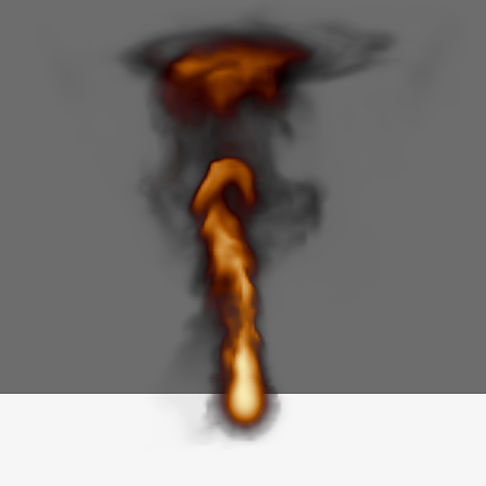

# GPU-GEMS-3D-Fluid-Simulation-RenderTexture

This fork replaces the original compute buffers with render textures.

This project is based on the GPU Gems 3D fluid simulation article. This article presents a method for calculating and rendering 3D fluid simulations. The method used for rendering was designed to best integrate the fluid simulation into the scene and have it interact with other scene components. I have gone with a simpler renderer however by using a ray tracer that is attached to a cube and there is no interaction with other scene components.

~~This project was originally written when Unity 4 was current and at that time render textures were not available in the free version. I decided to use compute buffers instead to make it more accessible. The only down side to using compute buffers instead of render textures is that there is no support for filtering. I added the code to the shaders to manually do the bi-linear filtering but its probably not as optimal as using a render texture.~~

[Position-Based-Dynamics](https://github.com/Scrawk/Position-Based-Dynamics)\
[PBD-Fluid-in-Unity](https://github.com/Scrawk/PBD-Fluid-in-Unity)\
[GPU-GEMS-NBody-Simulation](https://github.com/Scrawk/GPU-GEMS-NBody-Simulation)\
[GPU-GEMS-2D-Fluid-Simulation](https://github.com/Scrawk/GPU-GEMS-2D-Fluid-Simulation)\
[GPU-GEMS-3D-Fluid-Simulation](https://github.com/Scrawk/GPU-GEMS-3D-Fluid-Simulation)\
[CyclonePhysicsEngine](https://github.com/Scrawk/CyclonePhysicsEngine)\
[2D-Deformable-body-in-Unity](https://github.com/Scrawk/2D-Deformable-body-in-Unity)

